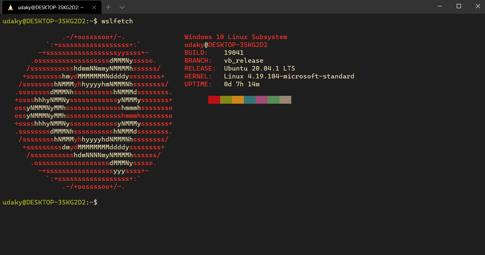

---

title: How to Install WSL 2 on Windows 10 May 2020 Update
slug: wsl-2-windows10
author: akashkumaryadav
image: ./wsl2.png
tags: wsl,linux,windows

---

  

## Table of content

1. Introduction

2. Install WSL2 on Windows 10

3. Install a Linux operating system for the windows subsystem for Linux

> ### Introduction

With Windows 10 20H1 preview builds Microsoft has introduced the new **Windows Subsystem for Linux version 2 (WSL 2)**. This is the Microsoft’s next version of the Windows Subsystem for Linux and includes a genuine open-source Linux kernel based on version 4.19  from Kernel.org. As it uses a real Linux kernel, Linux apps will now  have full access to their normal system calls. As Microsoft states their blog WSL2 improves compatibility for Linux apps and better file system  performance. WSL 2 is now using virtualization technology (based on  Hyper-V) and uses a lightweight utility VM on a real Linux kernel. You  can find out more about WSL 2 in the [release blog](https://devblogs.microsoft.com/commandline/wsl-2-is-now-available-in-windows-insiders?WT.mc_id=thomasmaurer-blog-thmaure) or on the [Microsoft Docs Page](https://docs.microsoft.com/en-us/windows/wsl/wsl2-about?WT.mc_id=thomasmaurer-blog-thmaure) for WSL 2. Here this post we show you how to install the Windows Subsystem for Linux 2 on Windows 10 machine.

> ### Install WSL2 on Windows 10

_Note: Currently windows subsystem for Linux 2 (**WSL2**) is only available only for devices running windows 10 20H1 build 18917 later_

To install WSL 2, you will need the following requirements:

- windows 10 Home edition _is used for this post_ Build **1904**
- A computer that supports Hyper-V virtualization

##### Enable the Windows Subsystem for Linux

- from start, menu search **turn windows feature on or off** 
- checkmark on windows subsystem for Linux
- click ok to allow windows to download and enable this feature

_make sure your pc is connected to the internet for above step_

- restart windows after to complete the process

##### Enable the Virtual Machine Platform

WSL 2 requires Windows 10’s “Virtual Machine Platform” feature to be  enabled. This is separate from Hyper-V and hands some of the more  interesting platform integrations available in the new version of the  Windows Subsystem for Linux.

##### To enable Virtual Machine Platform open *PowerShell* as Administrator and run:

<pre style="background-color:#ddd;colore:red;padding:1rem;">dism.exe /online /enable-feature /featurename:VirtualMachinePlatform /all /norestart</pre>

**_To ensure all of the relevant bits and pieces fall neatly in to place you should  restart your system at this point or you may find that things don’t work as intended._**

> ### Install a Linux Distro

With WSL and the necessary virtualization tech all in place all that  is left for you to do is pick and install a Linux distro from the  Microsoft Store. 

Several different distros are available, including *OpenSUSE*, Penguin, *Fedora Remix*, and *Alpine Linux*. But my personal recommendation is (naturally) Ubuntu 20.04 LTS (though 18.04 LTS and 16.04 LTS are also available).

To install Ubuntu on Windows 10 open the Microsoft Store app, search for “Ubuntu 20.04”, and hit the “Get” button:

<a target="_blank" style="background-color:#663399;text-decoration:none;color:white;padding:20px;margin:auto" href="https://www.microsoft.com/en-gb/p/ubuntu-2004-lts/9n6svws3rx71?activetab=pivot:overviewtab">Ubuntu 20.04 LTS on Microsoft store</a>

Whilst you in the Microsoft Store I highly recommend that you **also install the open source Windows Terminal app**. This tool is designed to give you the *best* possible WSL experience:

<a target="_blank" style="background-color:#663399;text-decoration:none;color:white;padding:20px;margin:auto" href="https://www.microsoft.com/en-gb/p/windows-terminal/9n0dx20hk701?activetab=pivot:overviewtab">New Windows Terminal</a>

#### Set WSL 2 as default

after getting your new distro it will run as WSL 1 by default to set the default for the WSL

open PowerShell  as administrator and type the following commands:

- wsl -l -v

  > list all your Linux distros and their version

-  wsl --set-version *distro-name* 2

  > eg: wsl --set-version  Ubuntu-20.04 2

- to make wsl 2 as default run

  > wsl --set-default-version 2

> ### Now open your new Linux distro and setup 😀
>
> ##### if it says something like you need to get a Linux kernel for wsl2
>
> ##### click on the following link and download kernel
>
> ##### NOTE: this link will be mentioned on your terminal also  
>
> [Linux kernel](`https://aka.ms/wsl2kernel`)

## MAKE THE MOST OF YOURSELF BY FANNING THE TINY, INNER SPARKS OF POSSIBILITY INTO FLAMES OF ACHIEVEMENT.

~ Golda Meir 😊😉